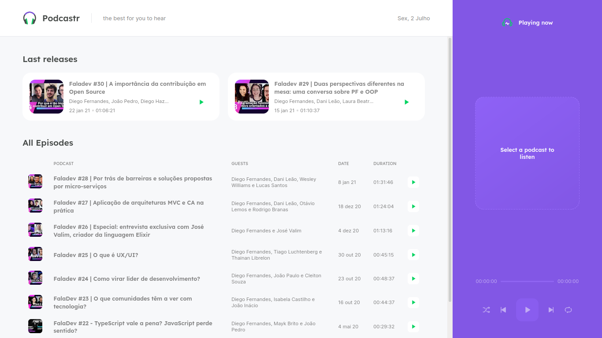

<p align="center">
   
</p>

<p align="center">
  <a aria-label="Completed" href="https://rocketseat.com.br/">
    </img>
    
  </a>
</p>

# Technologies

This project was made using the follow technologies:

- [Typescript](https://www.typescriptlang.org/)
- [React](https://reactjs.org/)
- [Nextjs](https://nextjs.org/)

</br>

# App

</br>

<p align="center">
   
</p>

<br/>

# How to run

```bash
# Clone Repository
$ git clone https://github.com/andersonmarquees/Podfutcastr.git
```

### 💻 Run Web Project

```bash
# Install Dependencies
$ yarn install

# Run Aplication
$ yarn dev
```
